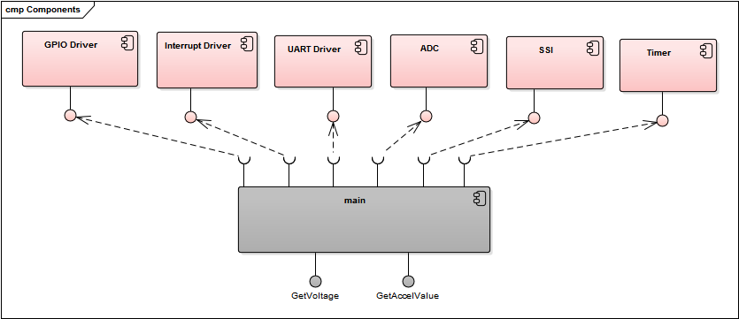
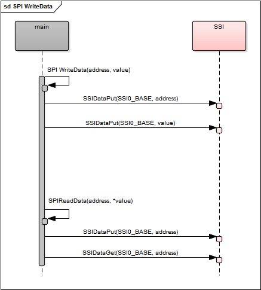
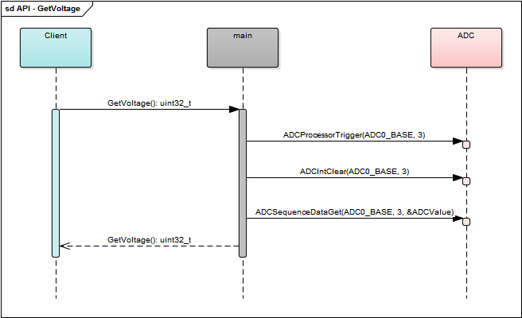

This is project contain example of initialization: ADC, UART, SPI and Timer, KX022 and MPU-9250 accelerometers.

Link to board: 
http://www.ti.com/tool/EK-TM4C123GXL

Links to accelerometers: 
http://www.kionix.com/product/KX022-1020
https://www.sparkfun.com/products/13762

Video: 
https://www.youtube.com/watch?v=1-T6J-lMQaI

ADC messure from 0 - 3.3V and return digital value 0-4095. For lipo or lion battery voltage messuring, change ADC referent voltage. 

